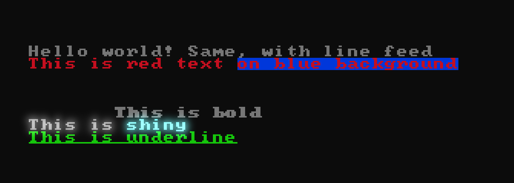

# text-mode

The goal of the `text-mode` DUB package is to be a virtual text-mode, like in older DOS machines, except with Unicode support instead of a single 8-bit code page. There is however a 16 color palette like in ancient text modes.

A secundary goal is to be efficient (everything is cached) and provide vintage looks.


## 0. Basic example

See `examples/` to run a basic example (you will need [SDL](https://www.libsdl.org/) installed).


### 1. Setup a `TM_Console`


The following `TM_Console` methods are necessary in order to use `text-mode`:
   - `size(int columns, int rows)`
   - `outbuf(void* p, int width, int height, int pitchBytes)`
   - `render()`


**Example:**
```d
TM_Console console;

void setup(MyImage image)
{
    // Set number of columns and rows.
    int columns = 40;
    int rows = 20;
 
    // .size clear the text buffer content and eventually resize it
    console.size(columns, rows);
 
    // set where to draw output, can be called every frame
    console.outbuf(image.ptr, image.width, image.height, image.pitchBytes);
 
    /* ...printing functions goes here... */
 
    // display changes since the last .render, in output buffer
     console.render();
}
```

> _**Key concept**: No font resampling is done. Pixels are scaled NxN depending to the room in output buffer, and letterboxed with "border" pixels._

 ### 2. Print some text

 **Example:**
```d
console.size(40, 22);

with (console)
{
    cls();
 
    print("Hello world! ");
    println("Same, with line feed");
 
    // Save state (colors, style, cursor position)
    save();
 
    // Change foreground color (0 to 15)
    fg(TM_red);
    print("This is red text ");
    bg(TM_blue);
    println("on blue background");
 
    // Restore state. Warning: this restore cursor position!
    restore();
 
    // Set text cursor position (where text is drawn next)
    locate(7, 5);
 
    // There are 3 implemented styles:
    //   - bold
    //   - shiny (sort of bloom)
    //   - underline
    style(TM_bold);
    println("This is bold");
 
    style(TM_shiny);
    print("This is ");
    fg(14);
    println("shiny");
 
    style(TM_underline);
    fg(TM_lgreen);
    println("This is underline");
 
    render();
}
``` 

**Result**



> _**Key-concept**: if text must be printed in a line below the screen, the whole screen scrolls._


### 3. CCL Language

 `print` and `println` accepts markup language.


         

 Accepted:
 - Foreground color: `<black>`, 
`<red>`, `<green>`, `<orange>`, `<blue>`, `<magenta>`, `<cyan>`, `<lgrey>`, `<grey>`, `<lred>`, `<lgreen>`, `<yellow>`, `<lblue>`, `<lmagenta>`, `<lcyan>`, `<white>`
- Background color: `<on_black>`, 
`<on_red>`, `<on_green>`, `<on_orange>`, `<on_blue>`, `<on_magenta>`, `<on_cyan>`, `<on_lgrey>`, `<on_grey>`, `<on_lred>`, `<on_lgreen>`, `<on_yellow>`, `<on_lblue>`, `<on_lmagenta>`, `<on_lcyan>`, `<on_white>`
 - Bold: `<b>`, `<strong>`
 - Underlined: `<u>`
 - Shiny: `<shiny>`
 - Blinking: `<blink>`

 **Example:**
```d
console.size(40, 22);
with (console)
{
    cls();
    println("<b>This is bold</b>");
}
```
 

### 4. Changing console options

```d
TM_Console console;
console.size(40, 22);

// You can change options at any time, everything is lazy.
TM_Options opt;
opt.blinkTime = 600; // See all options below
console.options(opt
```


Here is reproduced the definition of `TM_Options`:
```d
/// Various options to change behaviour of the library.
struct TM_Options
{
    TM_BlendMode blendMode = TM_BlendMode.sourceOver; ///
    TM_HorzAlign halign    = TM_HorzAlign.center; ///
    TM_VertAlign valign    = TM_VertAlign.middle; ///

    /// The output buffer is considered unchanged between calls.
    /// It is considered our changes are still there and not erased,
    /// unless the size of the buffer has changed, or its location.
    /// In this case we can draw less.
    bool allowOutCaching   = false;

    /// Palette color of the borderColor;
    ubyte borderColor      = 0;

    /// Is the border color itself <shiny>?
    bool borderShiny       = false;

    /// The <blink> time in milliseconds.
    double blinkTime = 1200;


    // <blur>

    /// Quantity of blur added by TM_shiny / <shiny>
    /// (1.0f means default).
    float blurAmount       = 1.0f;

    /// Kernel size in multiple of default value.
    /// This changes the blur filter width (1.0f means default).
    float blurScale        = 1.0f;

    /// Whether foreground/background color contributes to blur.
    bool blurForeground    = true;
    bool blurBackground    = true; ///ditto

    /// Luminance blue noise texture, applied to blur effect.
    bool noiseTexture      = true;

    /// Quantity of that texture (1.0f means default).
    float noiseAmount      = 1.0f;

    // </blur>


    // <tonemapping>

    /// Enable or disable tonemapping.
    bool tonemapping       = false;

    /// Channels that exceed 1.0f, bleed that much in other channels.
    float tonemappingRatio = 0.3f;

    // </tonemapping>
}
```


### 5. Direct character data access

If you'd like to not go through `print`/`println` then you can access character data with `charAt`.

```d
TM_Console console;
console.size(40, 22);
console.charAt(0, 0).glyph = '╚';
console.charAt(0, 0).color = 0x02 + 0x70;
console.charAt(0, 0).style = 0;
```

> `.charAt` return a `ref TM_CharData`.


## Unicode glyph supported

 - [x] 0020 — 007F: Basic Latin
 - [x] 00A0 — 00FF: Latin-1 Supplement
 - [x] 2500 — 257F: Box Drawing
 - [x] 2580 — 259F: Block Elements
 - [ ] 25A0 — 25FF: Geometric Shapes

